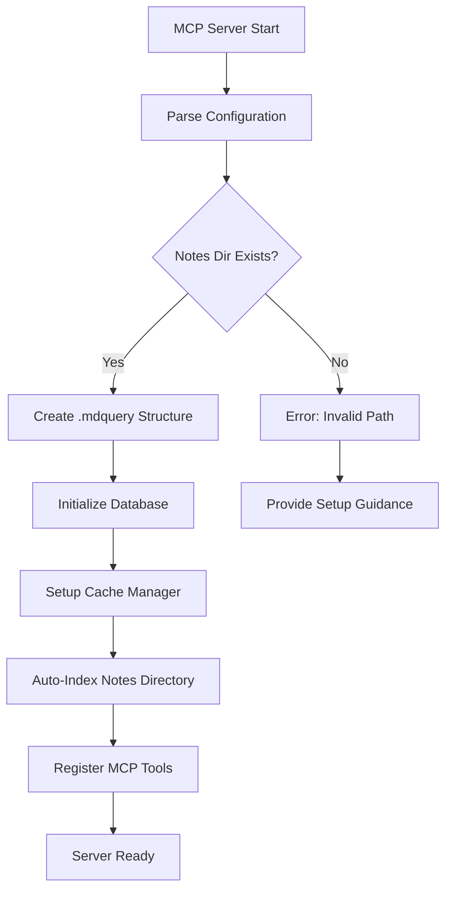

# Design Document

## Overview

This design optimizes mdquery's MCP server to support streamlined AI development workflows with minimal configuration. The core principle is "path-first configuration" where users only need to specify their notes directory, with intelligent defaults for database and cache locations. The system will automatically handle indexing and provide comprehensive analytical capabilities for AI development process improvement.

## Architecture

### Configuration Simplification

The MCP server will adopt a hierarchical configuration approach:

1. **Primary Configuration**: Notes directory path (required)
2. **Derived Paths**: Database and cache automatically placed within notes directory structure
3. **Override Options**: Optional explicit paths for database and cache when needed

```
Notes Directory Structure:
/path/to/obsidian-vault/
├── .mdquery/
│   ├── mdquery.db          # Default database location
│   ├── cache/              # Default cache directory
│   └── config.json         # Local configuration overrides
├── Daily Notes/
├── Projects/
└── *.md files
```

### MCP Server Initialization Flow



### Enhanced Query Intelligence

The system will provide AI assistants with enhanced context and query building capabilities:

1. **Query Templates**: Pre-built patterns for common analysis tasks
2. **Tag Hierarchy Understanding**: Intelligent parsing of hierarchical tags
3. **Content Grouping Logic**: Automatic topic clustering based on content similarity
4. **Workflow Analysis Patterns**: Specialized queries for development process analysis

## Components and Interfaces

### 1. Simplified Configuration Manager

```python
class SimplifiedConfig:
    def __init__(self, notes_dir: str, db_path: Optional[str] = None, cache_dir: Optional[str] = None):
        self.notes_dir = Path(notes_dir).expanduser().resolve()
        self.db_path = db_path or self.notes_dir / ".mdquery" / "mdquery.db"
        self.cache_dir = cache_dir or self.notes_dir / ".mdquery" / "cache"

    def validate_and_setup(self) -> None:
        """Validate paths and create necessary directories"""

    def get_mcp_config(self) -> Dict[str, Any]:
        """Generate MCP server configuration"""
```

### 2. Enhanced MCP Tools

#### Core Analysis Tools

```python
@server.tool()
async def comprehensive_tag_analysis(
    tag_patterns: str,
    grouping_strategy: str = "semantic",
    include_actionable: bool = True,
    include_theoretical: bool = True,
    remove_fluff: bool = True
) -> str:
    """
    Generate comprehensive analysis of tagged content with intelligent grouping.

    Args:
        tag_patterns: Tag patterns to analyze (e.g., "llm/coding", "ai/*")
        grouping_strategy: How to group content ("semantic", "tag-hierarchy", "temporal")
        include_actionable: Include practical recommendations
        include_theoretical: Include conceptual insights
        remove_fluff: Filter out superficial content
    """
```

#### Workflow Analysis Tools

```python
@server.tool()
async def analyze_development_workflow(
    focus_areas: Optional[str] = None,
    time_range: Optional[str] = None,
    improvement_categories: str = "process,tools,automation,quality"
) -> str:
    """
    Analyze AI development workflow patterns and suggest improvements.

    Args:
        focus_areas: Specific areas to focus on (e.g., "mcp,agents,automation")
        time_range: Time range for analysis (e.g., "last-3-months")
        improvement_categories: Types of improvements to identify
    """
```

#### Query Assistance Tools

```python
@server.tool()
async def get_query_guidance(
    analysis_type: str,
    content_description: str
) -> str:
    """
    Provide query syntax guidance and examples for specific analysis needs.

    Args:
        analysis_type: Type of analysis needed (e.g., "tag-analysis", "workflow-review")
        content_description: Description of the content to analyze
    """
```

### 3. Intelligent Content Analyzer

```python
class WorkflowAnalyzer:
    def __init__(self, query_engine: QueryEngine):
        self.query_engine = query_engine
        self.topic_clusterer = TopicClusterer()
        self.insight_extractor = InsightExtractor()

    def analyze_tagged_content(self, tag_patterns: List[str]) -> WorkflowAnalysis:
        """Analyze content with specified tag patterns"""

    def group_by_topics(self, content: List[Document]) -> Dict[str, List[Document]]:
        """Group content into logical topic clusters"""

    def extract_actionable_insights(self, content: List[Document]) -> List[ActionableInsight]:
        """Extract practical recommendations"""

    def extract_theoretical_insights(self, content: List[Document]) -> List[TheoreticalInsight]:
        """Extract conceptual insights and patterns"""
```

### 4. Auto-Configuration System

```python
class AutoConfigurationManager:
    def detect_note_system(self, notes_dir: Path) -> NoteSystemType:
        """Detect if directory is Obsidian, Joplin, etc."""

    def generate_optimal_config(self, notes_dir: Path) -> MCPServerConfig:
        """Generate optimal configuration based on detected system"""

    def setup_directory_structure(self, config: MCPServerConfig) -> None:
        """Create necessary directories and files"""
```

## Data Models

### Configuration Models

```python
@dataclass
class MCPServerConfig:
    notes_dir: Path
    db_path: Path
    cache_dir: Path
    auto_index: bool = True
    note_system_type: NoteSystemType = NoteSystemType.GENERIC

@dataclass
class WorkflowAnalysis:
    topic_groups: Dict[str, TopicGroup]
    actionable_insights: List[ActionableInsight]
    theoretical_insights: List[TheoreticalInsight]
    improvement_opportunities: List[ImprovementOpportunity]

@dataclass
class TopicGroup:
    name: str
    documents: List[Document]
    key_themes: List[str]
    related_groups: List[str]

@dataclass
class ActionableInsight:
    title: str
    description: str
    implementation_difficulty: str  # "low", "medium", "high"
    expected_impact: str  # "low", "medium", "high"
    category: str  # "process", "tools", "automation", "quality"

@dataclass
class TheoreticalInsight:
    title: str
    description: str
    related_concepts: List[str]
    research_directions: List[str]
```

### Enhanced Query Models

```python
@dataclass
class QueryTemplate:
    name: str
    description: str
    sql_template: str
    parameters: List[QueryParameter]
    example_usage: str

@dataclass
class QueryGuidance:
    suggested_queries: List[QueryTemplate]
    optimization_tips: List[str]
    common_patterns: List[str]
```

## Error Handling

### Graceful Degradation Strategy

1. **Configuration Errors**: Provide specific guidance for fixing configuration issues
2. **Indexing Failures**: Attempt incremental indexing, then full re-index if needed
3. **Query Errors**: Suggest query corrections and provide examples
4. **Performance Issues**: Automatically optimize queries and suggest alternatives

### Error Recovery Mechanisms

```python
class ErrorRecoveryManager:
    def handle_configuration_error(self, error: ConfigurationError) -> RecoveryAction:
        """Provide specific guidance for configuration issues"""

    def handle_indexing_failure(self, error: IndexingError) -> RecoveryAction:
        """Attempt recovery strategies for indexing failures"""

    def handle_query_error(self, error: QueryError) -> QuerySuggestion:
        """Suggest query corrections and alternatives"""
```

## Testing Strategy

### Integration Testing

1. **MCP Protocol Compliance**: Verify adherence to MCP specification
2. **AI Assistant Compatibility**: Test with multiple AI assistants
3. **Configuration Scenarios**: Test various configuration combinations
4. **Performance Benchmarks**: Ensure query performance meets requirements

### Workflow Testing

1. **End-to-End Scenarios**: Test complete user workflows
2. **Error Recovery**: Verify graceful error handling
3. **Auto-Configuration**: Test automatic setup processes
4. **Content Analysis**: Validate analysis accuracy and usefulness

### Test Scenarios

```python
class WorkflowTestScenarios:
    def test_obsidian_vault_setup(self):
        """Test automatic setup with Obsidian vault"""

    def test_comprehensive_tag_analysis(self):
        """Test the main use case: comprehensive tagged content analysis"""

    def test_ai_development_workflow_analysis(self):
        """Test AI development process improvement analysis"""

    def test_multi_assistant_compatibility(self):
        """Test compatibility across different AI assistants"""
```

## Performance Considerations

### Optimization Strategies

1. **Lazy Loading**: Load analysis components only when needed
2. **Caching**: Cache frequently accessed analysis results
3. **Incremental Processing**: Update analyses incrementally as content changes
4. **Query Optimization**: Automatically optimize complex analytical queries

### Scalability Design

```python
class PerformanceOptimizer:
    def optimize_tag_analysis_query(self, tag_patterns: List[str]) -> OptimizedQuery:
        """Optimize queries for tag-based analysis"""

    def cache_analysis_results(self, analysis: WorkflowAnalysis) -> None:
        """Cache analysis results for faster subsequent access"""

    def suggest_query_improvements(self, slow_query: str) -> List[QueryImprovement]:
        """Suggest improvements for slow-performing queries"""
```

## Security Considerations

### Data Protection

1. **Local Storage**: All data remains local to user's system
2. **Path Validation**: Prevent directory traversal attacks
3. **Database Security**: Use SQLite with appropriate permissions
4. **Configuration Validation**: Validate all configuration inputs

### Access Control

```python
class SecurityManager:
    def validate_path_access(self, path: Path) -> bool:
        """Ensure path access is within allowed boundaries"""

    def sanitize_query_input(self, query: str) -> str:
        """Sanitize user query input to prevent injection"""

    def validate_configuration(self, config: MCPServerConfig) -> ValidationResult:
        """Validate configuration for security issues"""
```

This design addresses your specific use case by:

1. **Simplifying Configuration**: Only requires notes directory path
2. **Automatic Setup**: Handles database and cache setup automatically
3. **Intelligent Analysis**: Provides comprehensive tag-based analysis with topic grouping
4. **AI Assistant Integration**: Optimized for natural language requests
5. **Obsidian Compatibility**: Specifically designed to work well with Obsidian vaults
6. **Error Resilience**: Robust error handling and recovery mechanisms

The system will enable your exact use case: configuring with just your Obsidian vault path and asking for comprehensive reports on tagged content with automatic topic grouping and actionable insights.