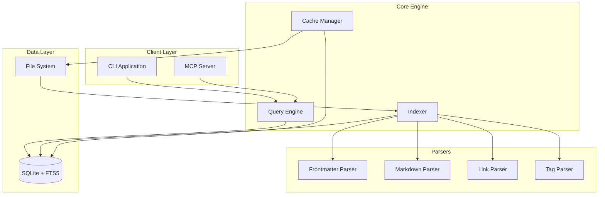

# Design Document

## Overview

mdquery is designed as a high-performance markdown querying system built around SQLite's FTS5 (Full-Text Search) extension. The architecture follows a layered approach with a core indexing engine, SQL query interface, and multiple client interfaces (CLI and MCP server). The system uses SQLite as both the query engine and caching layer to provide fast, SQL-like access to markdown collections.

## Architecture



## Components and Interfaces

### Core Engine Components

#### 1. Indexer (`mdquery.indexer`)
- **Purpose**: Scans directories, parses markdown files, and populates the SQLite database
- **Key Methods**:
  - `index_directory(path: Path, recursive: bool = True) -> None`
  - `index_file(file_path: Path) -> None`
  - `update_index(file_path: Path) -> None`
  - `rebuild_index() -> None`
- **Dependencies**: Frontmatter Parser, Markdown Parser, Link Parser, Tag Parser

#### 2. Query Engine (`mdquery.query`)
- **Purpose**: Translates SQL queries and executes them against the SQLite database
- **Key Methods**:
  - `execute_query(sql: str) -> QueryResult`
  - `validate_query(sql: str) -> bool`
  - `get_schema() -> Dict[str, Any]`
- **Features**: SQL injection protection, query optimization, result formatting

#### 3. Cache Manager (`mdquery.cache`)
- **Purpose**: Manages SQLite database lifecycle and file change detection
- **Key Methods**:
  - `initialize_cache(cache_path: Path) -> None`
  - `is_cache_valid() -> bool`
  - `invalidate_file(file_path: Path) -> None`
  - `cleanup_orphaned_entries() -> None`

### Parser Components

#### 1. Frontmatter Parser (`mdquery.parsers.frontmatter`)
- **Library**: `python-frontmatter`
- **Purpose**: Extracts YAML/JSON/TOML frontmatter from markdown files
- **Output**: Dictionary of frontmatter fields with type inference

#### 2. Markdown Parser (`mdquery.parsers.markdown`)
- **Library**: `markdown` with extensions
- **Purpose**: Extracts content, headings, and structure from markdown body
- **Features**: Heading hierarchy extraction, word count, content sanitization

#### 3. Link Parser (`mdquery.parsers.links`)
- **Purpose**: Extracts and categorizes links from markdown content
- **Types Supported**:
  - Standard markdown links: `[text](url)`
  - Wikilinks: `[[page]]` and `[[page|alias]]`
  - Reference links: `[text][ref]`

#### 4. Tag Parser (`mdquery.parsers.tags`)
- **Purpose**: Extracts tags from both frontmatter and content
- **Sources**:
  - Frontmatter tags array
  - Inline hashtags: `#tag`
  - Obsidian-style nested tags: `#parent/child`

### Client Interfaces

#### 1. CLI Application (`mdquery.cli`)
- **Framework**: `click` for command-line interface
- **Commands**:
  - `mdquery query "SELECT * FROM files WHERE tags LIKE '%research%'"`
  - `mdquery index /path/to/notes --recursive`
  - `mdquery schema --table files`
- **Output Formats**: JSON, CSV, table, markdown

#### 2. MCP Server (`mdquery.mcp`)
- **Framework**: MCP Python SDK
- **Tools Exposed**:
  - `query_markdown`: Execute SQL queries
  - `get_schema`: Retrieve database schema
  - `index_directory`: Trigger indexing
  - `get_file_content`: Retrieve specific file content

## Data Models

### SQLite Schema

#### Files Table
```sql
CREATE TABLE files (
    id INTEGER PRIMARY KEY,
    path TEXT UNIQUE NOT NULL,
    filename TEXT NOT NULL,
    directory TEXT NOT NULL,
    modified_date DATETIME NOT NULL,
    created_date DATETIME,
    file_size INTEGER NOT NULL,
    content_hash TEXT NOT NULL,
    word_count INTEGER DEFAULT 0,
    heading_count INTEGER DEFAULT 0
);
```

#### Frontmatter Table
```sql
CREATE TABLE frontmatter (
    file_id INTEGER REFERENCES files(id),
    key TEXT NOT NULL,
    value TEXT,
    value_type TEXT NOT NULL, -- 'string', 'number', 'boolean', 'array', 'date'
    PRIMARY KEY (file_id, key)
);
```

#### FTS5 Content Table
```sql
CREATE VIRTUAL TABLE content_fts USING fts5(
    file_id UNINDEXED,
    title,
    content,
    headings,
    content='', -- External content table
    content_rowid='file_id'
);
```

#### Tags Table
```sql
CREATE TABLE tags (
    file_id INTEGER REFERENCES files(id),
    tag TEXT NOT NULL,
    source TEXT NOT NULL, -- 'frontmatter' or 'content'
    PRIMARY KEY (file_id, tag)
);
```

#### Links Table
```sql
CREATE TABLE links (
    file_id INTEGER REFERENCES files(id),
    link_text TEXT,
    link_target TEXT NOT NULL,
    link_type TEXT NOT NULL, -- 'markdown', 'wikilink', 'reference'
    is_internal BOOLEAN DEFAULT FALSE
);
```

### Query Views

#### Unified Files View
```sql
CREATE VIEW files_with_metadata AS
SELECT
    f.*,
    GROUP_CONCAT(DISTINCT t.tag) as tags,
    COUNT(DISTINCT l.link_target) as link_count,
    fm_title.value as title,
    fm_description.value as description,
    fm_category.value as category
FROM files f
LEFT JOIN tags t ON f.id = t.file_id
LEFT JOIN links l ON f.id = l.file_id
LEFT JOIN frontmatter fm_title ON f.id = fm_title.file_id AND fm_title.key = 'title'
LEFT JOIN frontmatter fm_description ON f.id = fm_description.file_id AND fm_description.key = 'description'
LEFT JOIN frontmatter fm_category ON f.id = fm_category.file_id AND fm_category.key = 'category'
GROUP BY f.id;
```

## Error Handling

### File System Errors
- **Permission Errors**: Log warning and skip inaccessible files
- **Corrupted Files**: Log error with file path and continue processing
- **Missing Files**: Remove from index during cleanup operations

### Parsing Errors
- **Invalid YAML**: Log warning and skip frontmatter, process content only
- **Encoding Issues**: Attempt UTF-8 with fallback to latin-1, log encoding used
- **Malformed Markdown**: Process what's parseable, log warnings for issues

### Database Errors
- **Lock Conflicts**: Implement retry logic with exponential backoff
- **Disk Space**: Check available space before operations, fail gracefully
- **Corruption**: Detect and rebuild index automatically

### Query Errors
- **SQL Syntax**: Validate queries and return user-friendly error messages
- **Performance**: Implement query timeouts and complexity limits
- **Injection**: Use parameterized queries and input sanitization

## Testing Strategy

### Unit Tests
- **Parser Tests**: Test each parser with various markdown formats and edge cases
- **Indexer Tests**: Test file processing, incremental updates, and error handling
- **Query Tests**: Test SQL generation, execution, and result formatting
- **Cache Tests**: Test cache validation, invalidation, and cleanup

### Integration Tests
- **End-to-End CLI**: Test complete workflows from indexing to querying
- **MCP Server**: Test MCP protocol compliance and tool functionality
- **Multi-Format**: Test with real Obsidian, Joplin, and Jekyll collections
- **Performance**: Test with large collections (1000+ files)

### Test Data
- **Sample Collections**: Create representative test data for each supported format
- **Edge Cases**: Files with no frontmatter, empty files, binary files, symlinks
- **Performance Data**: Large collections for benchmarking and optimization

### Continuous Integration
- **Automated Testing**: Run full test suite on multiple Python versions
- **Performance Regression**: Track query performance over time
- **Compatibility Testing**: Test against different SQLite versions and platforms