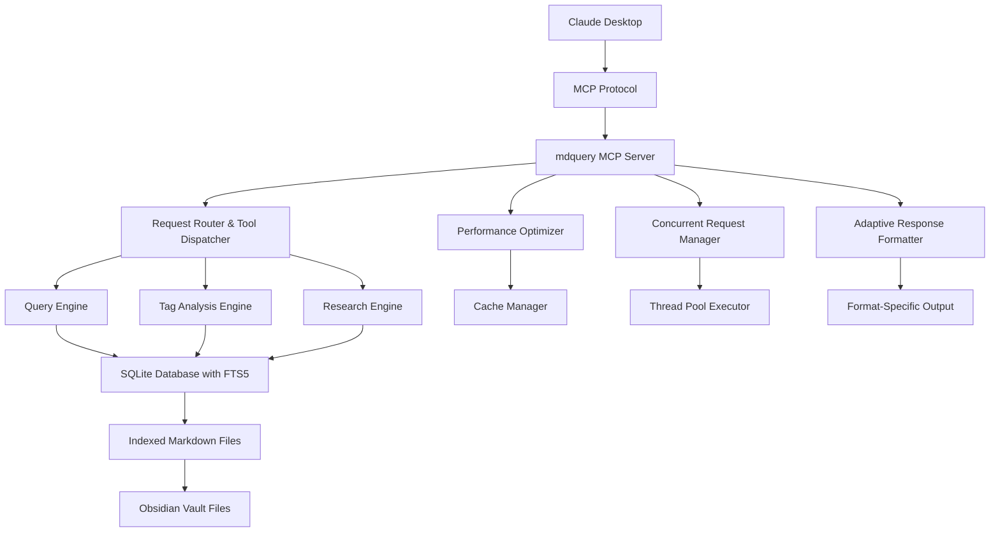

# Project Documentation Review and Claude Desktop MCP Integration Guide

## Overview

This document provides a comprehensive review of the mdquery project documentation alignment with the actual codebase implementation, followed by detailed setup instructions for testing the primary use case: connecting mdquery's MCP server to Claude Desktop for analyzing Obsidian vault content by tags and generating comprehensive topic-based reports.

## Technology Stack & Dependencies

The mdquery project is built as a Python CLI tool and library with the following key technologies:

- **Core Language**: Python 3.8+
- **Database**: SQLite3 with FTS5 extension for full-text search
- **CLI Framework**: Click for command-line interface
- **MCP Integration**: FastMCP server implementation
- **Async Processing**: asyncio with ThreadPoolExecutor for concurrent operations
- **Parsing Libraries**: python-frontmatter, PyYAML, toml, markdown

## Architecture Overview



## Core MCP Tools Available for Claude Desktop

### Query and Analysis Tools

#### query_markdown
- **Purpose**: Execute SQL queries against indexed markdown files
- **Parameters**:
  - `sql`: SQL query string
  - `format`: Output format (json, csv, table, markdown)
- **Use Case**: Find all files with specific tags, analyze content patterns

#### comprehensive_tag_analysis
- **Purpose**: Generate detailed analysis of tagged content with topic grouping
- **Parameters**:
  - `tag_patterns`: Comma-separated tag patterns
  - `grouping_strategy`: "alphabetical", "frequency", or "semantic"
  - `include_relationships`: Include tag co-occurrence analysis
- **Use Case**: Primary tool for generating comprehensive topic reports

#### research_content_analysis
- **Purpose**: Perform advanced content analysis and extract actionable insights
- **Parameters**:
  - `search_terms`: Terms to search for
  - `analysis_type`: Type of analysis to perform
  - `include_tutorials`: Extract step-by-step tutorials
- **Use Case**: Extract actionable content without fluff, identify tutorials

### Schema and Index Management

#### get_schema
- **Purpose**: Retrieve database schema information
- **Parameters**: `table` (optional), `include_stats` (optional)

#### index_directory
- **Purpose**: Index markdown files in specified directory
- **Parameters**: `path`, `recursive`, `force`

## Documentation Alignment Assessment

### Aligned Components
- **MCP Server Architecture**: Documentation matches implementation with FastMCP server
- **Query Engine**: SQL interface through SQLite with FTS5 properly documented
- **Tag Analysis**: Comprehensive tag analysis engine matches described capabilities
- **Configuration System**: SimplifiedConfig class aligns with documented approach

### Implementation Gaps Found
1. **Research Engine Integration**: While documented, deeper integration with MCP tools needs verification
2. **Adaptive Formatting**: Implementation exists but specific format options need validation
3. **Performance Optimization**: Components exist but specific tuning parameters need documentation update

## Step-by-Step Setup Guide for Claude Desktop Integration

### Prerequisites
1. Python 3.8+ installed
2. Claude Desktop application
3. Obsidian vault with tagged notes
4. Terminal/command line access

### Step 1: Install mdquery

```bash
# Navigate to project directory
cd /Users/eristoddle/Dropbox\ \(Maestral\)/python/mdquery

# Install dependencies
pip install -r requirements.txt

# Install mdquery in development mode
pip install -e .
```

### Step 2: Prepare Obsidian Vault for Indexing

```bash
# Set environment variable for your Obsidian vault
export MDQUERY_NOTES_DIR="/path/to/your/obsidian/vault"

# Example for common macOS Obsidian location:
export MDQUERY_NOTES_DIR="$HOME/Documents/ObsidianVault"
```

### Step 3: Initialize mdquery Database

```bash
# Index your Obsidian vault
mdquery index "$MDQUERY_NOTES_DIR" --recursive

# Verify indexing worked
mdquery query "SELECT COUNT(*) as total_files FROM files"

# Check for your specific tag
mdquery query "SELECT COUNT(*) as tagged_files FROM files WHERE tags LIKE '%your-tag%'"
```

### Step 4: Start MCP Server

```bash
# Start the MCP server
python -m mdquery.mcp_server
```

The server will start and listen for MCP connections.

### Step 5: Configure Claude Desktop

Create or edit Claude Desktop's MCP configuration file:

**macOS Location**: `~/Library/Application Support/Claude/claude_desktop_config.json`

```json
{
  "mcpServers": {
    "mdquery": {
      "command": "python",
      "args": ["-m", "mdquery.mcp_server"],
      "env": {
        "MDQUERY_NOTES_DIR": "/path/to/your/obsidian/vault"
      }
    }
  }
}
```

### Step 6: Restart Claude Desktop

Completely quit and restart Claude Desktop for the MCP configuration to take effect.

## Optimized Claude Desktop Prompt for Tag-Based Topic Analysis

### Primary Analysis Prompt

```markdown
I need a comprehensive topic-based analysis of my research notes. Please help me analyze documents tagged with [YOUR_TAG] in my Obsidian vault and create a detailed guidebook organized by topics.

**Requirements:**
1. **No summaries or fluff** - I want actionable content only
2. **Complete tutorial steps** - If you find tutorials, include all steps for recreation
3. **Topic organization** - Break content into logical topic groups
4. **Comprehensive coverage** - This is for deep research, not quick overview

**Analysis Steps:**
1. First, get an overview of my tagged content:
   - Use `comprehensive_tag_analysis` with my tag pattern
   - Use semantic grouping strategy
   - Include relationship analysis

2. Then, for each major topic identified:
   - Extract all actionable items, procedures, and methods
   - Identify complete tutorials with step-by-step instructions
   - Find relevant examples and case studies
   - Note important references and resources

3. Finally, organize everything into a structured guidebook format with:
   - Topic-based sections
   - Actionable subsections within each topic
   - Complete tutorial reproductions
   - Reference materials and links

**My tag pattern**: [YOUR_TAG]
**Expected output**: A comprehensive guidebook I can use for practical implementation

Please start by analyzing my tagged content and then proceed with the detailed extraction and organization.
```

### Follow-up Query Prompts

For deeper analysis of specific topics found:

```markdown
Based on the initial analysis, I want to dive deeper into [SPECIFIC_TOPIC]. Please:

1. Find all content related to this topic using targeted queries
2. Extract step-by-step procedures and tutorials
3. Identify best practices and methodologies
4. Compile actionable resources and tools
5. Create a focused sub-guidebook for this topic

Use both SQL queries and content analysis tools to ensure comprehensive coverage.
```

### Tutorial Extraction Prompt

```markdown
I noticed references to tutorials in the analysis. Please use the research_content_analysis tool to:

1. Search for tutorial content in my tagged notes
2. Extract complete step-by-step procedures
3. Identify prerequisites and requirements
4. Include any code examples or commands
5. Format as actionable guides I can follow

Focus on completeness - I want to be able to recreate everything without referring back to original sources.
```

## Testing Validation Checklist

### Basic Functionality Tests
- [ ] MCP server starts without errors
- [ ] Claude Desktop connects to mdquery MCP server
- [ ] Basic queries return expected results
- [ ] Tag analysis generates meaningful output

### Use Case Specific Tests
- [ ] Comprehensive tag analysis works with your specific tag
- [ ] Topic grouping produces logical categories
- [ ] Tutorial extraction identifies step-by-step content
- [ ] Research analysis removes fluff while preserving actionable items
- [ ] Output formatting is suitable for guidebook creation

### Performance Tests
- [ ] Analysis completes within reasonable time (< 30 seconds for 100s of files)
- [ ] Multiple concurrent requests handled properly
- [ ] Memory usage remains stable during analysis

## Troubleshooting Common Issues

### MCP Connection Problems
1. **Server Not Starting**: Check Python path and dependencies
2. **Claude Can't Connect**: Verify MCP configuration JSON syntax
3. **Permission Errors**: Ensure Claude Desktop has file access permissions

### Query Performance Issues
1. **Slow Queries**: Check database indexing status
2. **Memory Usage**: Monitor cache settings and adjust if needed
3. **Timeout Errors**: Increase timeout settings in MCP configuration

### Content Analysis Issues
1. **Missing Content**: Verify file indexing completed successfully
2. **Incomplete Tag Detection**: Check Obsidian tag format compatibility
3. **Poor Topic Grouping**: Experiment with different grouping strategies

## Expected Output Format

The comprehensive tag analysis will produce:

1. **Topic Overview**: High-level categorization of your tagged content
2. **Detailed Topic Sections**: In-depth analysis of each topic area
3. **Actionable Items**: Specific procedures, methods, and techniques
4. **Complete Tutorials**: Step-by-step guides extracted from your notes
5. **Resource Compilation**: Links, tools, and references organized by topic
6. **Cross-References**: Connections between related topics and concepts

This analysis serves as a practical guidebook for implementing the knowledge contained in your research notes, organized for maximum utility and minimal redundancy.