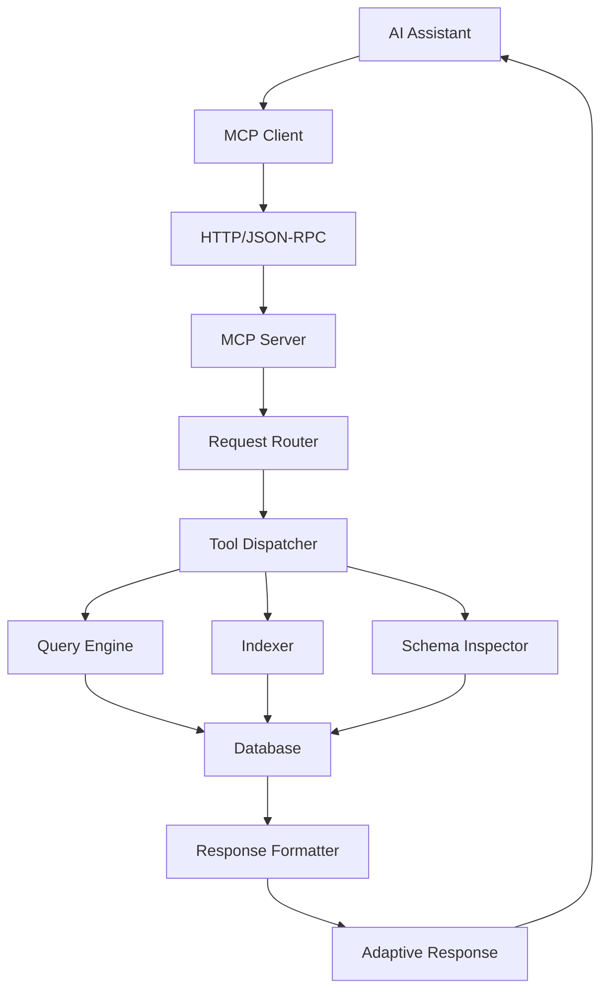

# AI Assistant Integration (MCP)

## Overview

mdquery provides comprehensive integration with AI assistants through the Model Context Protocol (MCP). This integration enables AI assistants to query, analyze, and interact with markdown repositories programmatically, making it a powerful tool for AI-enhanced knowledge management workflows.

## MCP Server Setup Guide

### Installation and Basic Setup

The MCP server is included with mdquery and can be started with minimal configuration:

```bash
# Start MCP server with notes directory
mdquery mcp --notes-dir ~/Documents/Notes

# Start with custom configuration
mdquery mcp --config mcp_config.json

# Start with environment variables
MDQUERY_NOTES_DIR=~/Documents/Notes mdquery mcp
```

### Configuration File Setup

Create a dedicated MCP configuration file:

```json
{
  "notes_dir": "/path/to/your/notes",
  "db_path": "/path/to/mdquery.db",
  "cache_dir": "/path/to/cache",
  "mcp": {
    "host": "localhost",
    "port": 8080,
    "auto_index": true,
    "enable_cors": false,
    "max_concurrent_requests": 10,
    "request_timeout": 30,
    "enable_query_optimization": true,
    "adaptive_formatting": true
  },
  "ai_integration": {
    "response_format": "json",
    "include_metadata": true,
    "max_response_size": 10000,
    "enable_context_enhancement": true,
    "support_streaming": false
  },
  "security": {
    "allowed_origins": ["*"],
    "rate_limiting": {
      "enabled": true,
      "requests_per_minute": 60
    },
    "query_validation": {
      "strict_mode": true,
      "allow_complex_queries": true
    }
  }
}
```

### Server Architecture

The MCP server implements a layered architecture for AI assistant integration:



## MCP Capabilities and Exposed Functions

### Core Query Tools

#### query_markdown

Execute SQL queries against the markdown database.

**Function Signature:**
```python
async def query_markdown(
    sql: str,
    format: str = "json",
    limit: Optional[int] = None,
    include_metadata: bool = True
) -> str
```

**Parameters:**
- `sql`: SQL query to execute
- `format`: Output format (json, csv, table, markdown)
- `limit`: Maximum number of results
- `include_metadata`: Include query metadata in response

**Example Usage:**
```json
{
  "tool": "query_markdown",
  "arguments": {
    "sql": "SELECT filename, word_count FROM files WHERE tags LIKE '%research%'",
    "format": "json",
    "limit": 10
  }
}
```

#### get_schema

Retrieve database schema information.

**Function Signature:**
```python
async def get_schema(
    table: Optional[str] = None,
    include_stats: bool = False
) -> str
```

**Parameters:**
- `table`: Specific table to get schema for (optional)
- `include_stats`: Include table statistics

**Example Usage:**
```json
{
  "tool": "get_schema",
  "arguments": {
    "table": "files",
    "include_stats": true
  }
}
```

### Index Management Tools

#### index_directory

Index markdown files in a directory.

**Function Signature:**
```python
async def index_directory(
    path: str,
    recursive: bool = True,
    force: bool = False
) -> str
```

**Parameters:**
- `path`: Directory path to index
- `recursive`: Include subdirectories
- `force`: Force reindexing of existing files

#### index_multiple_directories

Index multiple directories in a single operation.

**Function Signature:**
```python
async def index_multiple_directories(
    paths: List[str],
    recursive: bool = True
) -> str
```

### Content Analysis Tools

#### comprehensive_tag_analysis

Generate comprehensive analysis of tagged content.

**Function Signature:**
```python
async def comprehensive_tag_analysis(
    tag_patterns: Optional[str] = None,
    grouping_strategy: str = "alphabetical",
    include_relationships: bool = True
) -> str
```

**Parameters:**
- `tag_patterns`: Comma-separated tag patterns to analyze
- `grouping_strategy`: How to group results (alphabetical, frequency, semantic)
- `include_relationships`: Include tag co-occurrence analysis

#### analyze_content_structure

Analyze the structural patterns in markdown content.

**Function Signature:**
```python
async def analyze_content_structure(
    content_type: str = "all",
    include_metrics: bool = True
) -> str
```

#### fuzzy_search

Perform fuzzy text matching for content discovery.

**Function Signature:**
```python
async def fuzzy_search(
    query: str,
    search_fields: List[str] = ["title", "content"],
    max_results: int = 20
) -> str
```

### Research and Analysis Tools

#### analyze_development_workflow

Analyze AI development workflow patterns in the repository.

**Function Signature:**
```python
async def analyze_development_workflow(
    analysis_type: str = "comprehensive",
    time_period: Optional[str] = None
) -> str
```

#### filter_by_research_criteria

Filter content based on research-specific criteria.

**Function Signature:**
```python
async def filter_by_research_criteria(
    criteria: str,
    research_type: str = "general"
) -> str
```

### Query Assistance Tools

#### get_query_guidance

Provide query syntax guidance and examples.

**Function Signature:**
```python
async def get_query_guidance(
    analysis_type: str,
    content_description: str = ""
) -> str
```

**Parameters:**
- `analysis_type`: Type of analysis needed
- `content_description`: Description of content to analyze

#### get_query_templates

Get pre-built query templates by category.

**Function Signature:**
```python
async def get_query_templates(
    category: str = "all",
    complexity: str = "medium"
) -> str
```

## Security and Access Control

### Authentication and Authorization

The MCP server implements several security measures:

```json
{
  "security": {
    "authentication": {
      "enabled": false,
      "type": "api_key",
      "api_key": "your-secure-api-key"
    },
    "authorization": {
      "enabled": false,
      "allowed_operations": ["query", "schema", "analyze"],
      "restricted_operations": ["index", "admin"]
    },
    "input_validation": {
      "strict_sql_validation": true,
      "max_query_length": 10000,
      "blocked_operations": ["DROP", "DELETE", "INSERT", "UPDATE"],
      "allowed_functions": ["SELECT", "COUNT", "GROUP BY", "ORDER BY"]
    }
  }
}
```

### Query Validation and Safety

All SQL queries are validated for safety:

1. **Syntax Validation**: Ensures valid SQL syntax
2. **Security Filtering**: Blocks dangerous operations
3. **Resource Limits**: Prevents resource exhaustion
4. **Timeout Protection**: Limits query execution time

```python
# Example query validation
validation_rules = {
    "allowed_statements": ["SELECT"],
    "blocked_keywords": ["DROP", "DELETE", "INSERT", "UPDATE", "ALTER"],
    "max_execution_time": 30,
    "max_result_rows": 10000,
    "require_where_clause": False,
    "allow_subqueries": True
}
```

### Rate Limiting and Resource Management

Protect the server from abuse:

```json
{
  "rate_limiting": {
    "enabled": true,
    "requests_per_minute": 60,
    "burst_limit": 10,
    "per_ip_limit": true
  },
  "resource_management": {
    "max_concurrent_requests": 10,
    "request_timeout": 30,
    "memory_limit_mb": 512,
    "temp_file_cleanup": true
  }
}
```

## Usage Examples and AI Assistant Integration

### Claude Desktop Integration

Configure Claude Desktop to use the MCP server:

1. **Add MCP Server Configuration** to Claude Desktop settings:

```json
{
  "mcpServers": {
    "mdquery": {
      "command": "python",
      "args": ["-m", "mdquery.mcp_server"],
      "env": {
        "MDQUERY_NOTES_DIR": "/path/to/your/notes"
      }
    }
  }
}
```

2. **Example Claude Interactions:**

```
User: "Find all my research notes about machine learning"

Claude: I'll search your notes for machine learning research content.

[Calls query_markdown tool]
```

### Generic AI Assistant Integration

For other AI assistants, use the HTTP JSON-RPC interface:

```python
import json
import requests

# Connect to MCP server
mcp_url = "http://localhost:8080/mcp"

# Query request
query_request = {
    "jsonrpc": "2.0",
    "method": "tools/call",
    "params": {
        "name": "query_markdown",
        "arguments": {
            "sql": "SELECT filename, tags FROM files WHERE content MATCH 'AI research'",
            "format": "json",
            "limit": 10
        }
    },
    "id": 1
}

response = requests.post(mcp_url, json=query_request)
result = response.json()
```

### Workflow Examples

#### Research Assistant Workflow

1. **Find Related Notes:**
```json
{
  "tool": "fuzzy_search",
  "arguments": {
    "query": "machine learning algorithms",
    "max_results": 15
  }
}
```

2. **Analyze Tag Patterns:**
```json
{
  "tool": "comprehensive_tag_analysis",
  "arguments": {
    "tag_patterns": "ml,ai,research",
    "grouping_strategy": "semantic"
  }
}
```

3. **Generate Query for Specific Analysis:**
```json
{
  "tool": "get_query_guidance",
  "arguments": {
    "analysis_type": "trend_analysis",
    "content_description": "machine learning research papers"
  }
}
```

#### Content Organization Workflow

1. **Analyze Content Structure:**
```json
{
  "tool": "analyze_content_structure",
  "arguments": {
    "content_type": "research_notes",
    "include_metrics": true
  }
}
```

2. **Find Orphaned Content:**
```json
{
  "tool": "query_markdown",
  "arguments": {
    "sql": "SELECT filename FROM files WHERE id NOT IN (SELECT DISTINCT file_id FROM tags) AND id NOT IN (SELECT DISTINCT file_id FROM links)"
  }
}
```

3. **Index New Content:**
```json
{
  "tool": "index_directory",
  "arguments": {
    "path": "/path/to/new/notes",
    "recursive": true
  }
}
```

## Advanced Features

### Adaptive Response Formatting

The MCP server adapts responses based on the AI assistant type:

```python
# Automatic client detection and response formatting
class AdaptiveResponseFormatter:
    def format_for_client(self, data, client_type):
        if client_type == "claude":
            return self.format_for_claude(data)
        elif client_type == "gpt":
            return self.format_for_gpt(data)
        else:
            return self.format_generic(data)
```

### Streaming Responses

For large results, enable streaming responses:

```json
{
  "ai_integration": {
    "support_streaming": true,
    "chunk_size": 1000,
    "stream_threshold": 5000
  }
}
```

### Context Enhancement

Automatically enhance responses with relevant context:

```python
# Context enhancement for AI assistants
async def enhance_response_context(result, query_type):
    if query_type == "content_search":
        # Add related tags and links
        enhanced_result = add_related_content(result)
    elif query_type == "tag_analysis":
        # Add tag hierarchies and relationships
        enhanced_result = add_tag_context(result)

    return enhanced_result
```

### Performance Monitoring for AI Integration

Monitor AI assistant usage patterns:

```python
# MCP performance metrics
mcp_stats = mcp_server.get_performance_metrics()
print(f"Total AI requests: {mcp_stats.total_requests}")
print(f"Average response time: {mcp_stats.avg_response_time:.3f}s")
print(f"Most used tools: {mcp_stats.popular_tools}")
```

## Troubleshooting MCP Integration

### Common Issues

1. **Connection Issues**: Check server status and network connectivity
2. **Authentication Failures**: Verify API keys and permissions
3. **Query Timeouts**: Optimize queries or increase timeout limits
4. **Memory Issues**: Reduce result set sizes or enable streaming

### Debugging Tools

```python
# Enable debug logging
import logging
logging.getLogger('mdquery.mcp').setLevel(logging.DEBUG)

# Test MCP connection
async def test_mcp_connection():
    try:
        schema = await mcp_client.call_tool("get_schema")
        print("MCP connection successful")
        return True
    except Exception as e:
        print(f"MCP connection failed: {e}")
        return False
```

### Health Checks

The MCP server provides health check endpoints:

```bash
# Check server health
curl http://localhost:8080/health

# Check specific tool availability
curl http://localhost:8080/tools/status
```