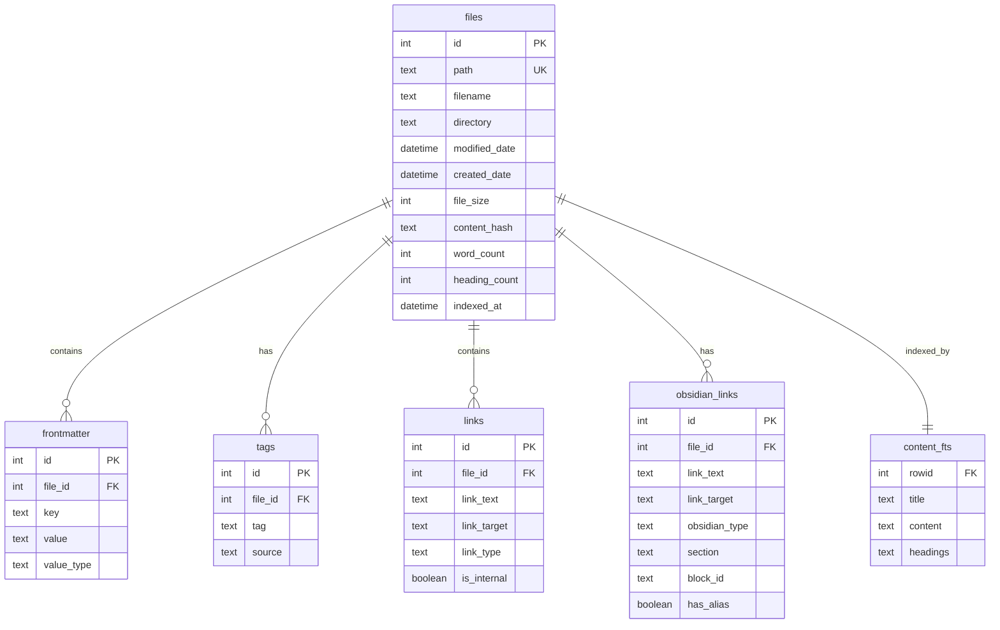

# Database Schema Design

## Overview

mdquery uses a carefully designed SQLite database schema to store extracted markdown content and metadata efficiently. The schema supports full-text search, complex relationships, and high-performance querying while maintaining data integrity and consistency.

## Notes Table

### Primary Files Table

The `files` table is the central table that stores core metadata about each indexed markdown file:

```sql
CREATE TABLE files (
    id INTEGER PRIMARY KEY AUTOINCREMENT,
    path TEXT UNIQUE NOT NULL,
    filename TEXT NOT NULL,
    directory TEXT NOT NULL,
    modified_date DATETIME NOT NULL,
    created_date DATETIME,
    file_size INTEGER NOT NULL,
    content_hash TEXT NOT NULL,
    word_count INTEGER DEFAULT 0,
    heading_count INTEGER DEFAULT 0,
    indexed_at DATETIME DEFAULT CURRENT_TIMESTAMP
);
```

#### Column Descriptions

- **id**: Primary key, auto-incrementing unique identifier
- **path**: Full file path (unique constraint ensures no duplicates)
- **filename**: File name without directory path
- **directory**: Directory containing the file
- **modified_date**: File system modification timestamp
- **created_date**: File system creation timestamp (may be null)
- **file_size**: File size in bytes
- **content_hash**: SHA-256 hash of file content for change detection
- **word_count**: Number of words in the document
- **heading_count**: Number of headings (H1-H6) in the document
- **indexed_at**: Timestamp when file was indexed

#### Indexes

```sql
CREATE INDEX idx_files_path ON files(path);
CREATE INDEX idx_files_modified_date ON files(modified_date);
CREATE INDEX idx_files_directory ON files(directory);
CREATE INDEX idx_files_content_hash ON files(content_hash);
```

### Files with Metadata View

A convenient view that joins common metadata:

```sql
CREATE VIEW files_with_metadata AS
SELECT
    f.id,
    f.path,
    f.filename,
    f.directory,
    f.modified_date,
    f.created_date,
    f.file_size,
    f.word_count,
    f.heading_count,
    f.indexed_at,
    title_fm.value AS title,
    GROUP_CONCAT(DISTINCT t.tag) AS tags,
    COUNT(DISTINCT l.id) AS link_count
FROM files f
LEFT JOIN frontmatter title_fm ON f.id = title_fm.file_id AND title_fm.key = 'title'
LEFT JOIN tags t ON f.id = t.file_id
LEFT JOIN links l ON f.id = l.file_id
GROUP BY f.id;
```

## Tags Table and Note Tagging System

### Tags Table Structure

```sql
CREATE TABLE tags (
    id INTEGER PRIMARY KEY AUTOINCREMENT,
    file_id INTEGER NOT NULL,
    tag TEXT NOT NULL,
    source TEXT NOT NULL,
    FOREIGN KEY (file_id) REFERENCES files(id) ON DELETE CASCADE
);
```

#### Column Descriptions

- **id**: Primary key for the tag record
- **file_id**: Foreign key reference to files table
- **tag**: The tag text (normalized)
- **source**: Source of the tag (frontmatter, content, inline, etc.)

#### Tag Sources

Tags can come from multiple sources:
- `frontmatter`: From YAML/TOML frontmatter
- `content`: Hashtags found in content (#tag)
- `inline`: Joplin-style inline tags
- `obsidian`: Obsidian-specific tag formats

#### Indexes

```sql
CREATE INDEX idx_tags_file_id ON tags(file_id);
CREATE INDEX idx_tags_tag ON tags(tag);
CREATE INDEX idx_tags_source ON tags(source);
CREATE UNIQUE INDEX idx_tags_unique ON tags(file_id, tag, source);
```

### Tag Normalization

Tags are normalized during extraction:
- Converted to lowercase
- Spaces replaced with hyphens
- Special characters removed
- Unicode normalized

```python
def normalize_tag(tag):
    """Normalize tag for consistent storage"""
    normalized = tag.lower()
    normalized = re.sub(r'\s+', '-', normalized)
    normalized = re.sub(r'[^\w\-/]', '', normalized)
    return normalized
```

### Hierarchical Tags

Obsidian-style nested tags are supported:

```sql
-- Find all research subtags
SELECT tag FROM tags WHERE tag LIKE 'research/%';

-- Get tag hierarchy levels
SELECT
    tag,
    LENGTH(tag) - LENGTH(REPLACE(tag, '/', '')) + 1 as level
FROM tags
WHERE tag LIKE '%/%'
ORDER BY level, tag;
```

## Links Table

### Link Storage Structure

```sql
CREATE TABLE links (
    id INTEGER PRIMARY KEY AUTOINCREMENT,
    file_id INTEGER NOT NULL,
    link_text TEXT NOT NULL,
    link_target TEXT NOT NULL,
    link_type TEXT NOT NULL,
    is_internal BOOLEAN NOT NULL DEFAULT 0,
    FOREIGN KEY (file_id) REFERENCES files(id) ON DELETE CASCADE
);
```

#### Column Descriptions

- **id**: Primary key for the link record
- **file_id**: Foreign key reference to files table
- **link_text**: Display text of the link
- **link_target**: Target URL or file path
- **link_type**: Type of link (markdown, wikilink, embed, etc.)
- **is_internal**: Boolean indicating internal (true) vs external (false) links

#### Link Types

- `markdown`: Standard markdown links `[text](url)`
- `wikilink`: Obsidian-style wikilinks `[[target]]`
- `embed`: Embedded content `![[file]]`
- `reference`: Reference-style links `[text][ref]`
- `autolink`: Automatic URL detection
- `resource`: Joplin resource links

#### Indexes

```sql
CREATE INDEX idx_links_file_id ON links(file_id);
CREATE INDEX idx_links_target ON links(link_target);
CREATE INDEX idx_links_type ON links(link_type);
CREATE INDEX idx_links_internal ON links(is_internal);
```

### Obsidian-Specific Links

For Obsidian vaults, additional link metadata is stored in a separate table:

```sql
CREATE TABLE obsidian_links (
    id INTEGER PRIMARY KEY AUTOINCREMENT,
    file_id INTEGER NOT NULL,
    link_text TEXT NOT NULL,
    link_target TEXT NOT NULL,
    obsidian_type TEXT NOT NULL, -- wikilink, embed, reference
    section TEXT,                -- Section reference (#section)
    block_id TEXT,              -- Block reference (^block-id)
    has_alias BOOLEAN DEFAULT 0, -- Whether link has custom alias
    FOREIGN KEY (file_id) REFERENCES files(id) ON DELETE CASCADE
);
```

## Frontmatter Table

### Frontmatter Storage

Frontmatter data is stored in a flexible key-value structure:

```sql
CREATE TABLE frontmatter (
    id INTEGER PRIMARY KEY AUTOINCREMENT,
    file_id INTEGER NOT NULL,
    key TEXT NOT NULL,
    value TEXT NOT NULL,
    value_type TEXT NOT NULL, -- string, array, number, boolean, date
    FOREIGN KEY (file_id) REFERENCES files(id) ON DELETE CASCADE
);
```

#### Column Descriptions

- **id**: Primary key for the frontmatter record
- **file_id**: Foreign key reference to files table
- **key**: Frontmatter key name
- **value**: Serialized value (JSON for complex types)
- **value_type**: Data type for proper deserialization

#### Value Types

- `string`: Simple text values
- `array`: Lists/arrays (stored as JSON)
- `number`: Numeric values (integers and floats)
- `boolean`: Boolean values (true/false)
- `date`: Date/datetime values (ISO format)
- `object`: Complex objects (stored as JSON)

#### Indexes

```sql
CREATE INDEX idx_frontmatter_file_id ON frontmatter(file_id);
CREATE INDEX idx_frontmatter_key ON frontmatter(key);
CREATE INDEX idx_frontmatter_key_value ON frontmatter(key, value);
```

### Frontmatter Queries

Common frontmatter query patterns:

```sql
-- Find files with specific frontmatter key
SELECT f.filename, fm.value
FROM files f
JOIN frontmatter fm ON f.id = fm.file_id
WHERE fm.key = 'author';

-- Find files by frontmatter value
SELECT f.filename
FROM files f
JOIN frontmatter fm ON f.id = fm.file_id
WHERE fm.key = 'status' AND fm.value = 'published';

-- Get all frontmatter for a file
SELECT fm.key, fm.value, fm.value_type
FROM frontmatter fm
JOIN files f ON fm.file_id = f.id
WHERE f.filename = 'example.md';
```

## FTS5 Full-Text Search Configuration

### Content FTS Table

Full-text search is implemented using SQLite FTS5:

```sql
CREATE VIRTUAL TABLE content_fts USING fts5(
    title,
    content,
    headings,
    content='files',           -- External content table
    content_rowid='id',        -- Row ID mapping
    tokenize='porter ascii'    -- Porter stemming with ASCII folding
);
```

#### FTS5 Columns

- **title**: Document title (from frontmatter or first heading)
- **content**: Main document content (markdown processed)
- **headings**: All headings concatenated for structure search

#### FTS5 Configuration

- **porter tokenizer**: Enables stemming (running/runs/ran → run)
- **ascii folding**: Normalizes accented characters
- **External content**: References main files table for efficiency

### FTS5 Triggers

Automatic FTS index maintenance:

```sql
-- Insert trigger
CREATE TRIGGER content_fts_insert AFTER INSERT ON files
BEGIN
    INSERT INTO content_fts(rowid, title, content, headings)
    VALUES (new.id, new.title, new.content, new.headings);
END;

-- Update trigger
CREATE TRIGGER content_fts_update AFTER UPDATE ON files
BEGIN
    UPDATE content_fts
    SET title = new.title, content = new.content, headings = new.headings
    WHERE rowid = new.id;
END;

-- Delete trigger
CREATE TRIGGER content_fts_delete AFTER DELETE ON files
BEGIN
    DELETE FROM content_fts WHERE rowid = old.id;
END;
```

### FTS5 Query Examples

```sql
-- Basic content search
SELECT filename FROM files
WHERE id IN (
    SELECT rowid FROM content_fts WHERE content_fts MATCH 'python programming'
);

-- Field-specific search
SELECT filename FROM files
WHERE id IN (
    SELECT rowid FROM content_fts WHERE content_fts MATCH 'title:introduction'
);

-- Phrase search with ranking
SELECT filename, rank FROM files f
JOIN (
    SELECT rowid, rank FROM content_fts
    WHERE content_fts MATCH '"machine learning"'
    ORDER BY rank
) fts ON f.id = fts.rowid;
```

## Entity Relationships and Data Access Patterns

### Entity Relationship Diagram



### Common Access Patterns

#### 1. File with All Metadata

```sql
-- Get complete file information
SELECT
    f.*,
    GROUP_CONCAT(DISTINCT t.tag) as tags,
    COUNT(DISTINCT l.id) as link_count,
    title_fm.value as title
FROM files f
LEFT JOIN tags t ON f.id = t.file_id
LEFT JOIN links l ON f.id = l.file_id
LEFT JOIN frontmatter title_fm ON f.id = title_fm.file_id AND title_fm.key = 'title'
WHERE f.id = ?
GROUP BY f.id;
```

#### 2. Tag-Based Discovery

```sql
-- Find files with similar tags
WITH file_tags AS (
    SELECT file_id, GROUP_CONCAT(tag) as tags
    FROM tags
    GROUP BY file_id
)
SELECT f.filename, ft.tags
FROM files f
JOIN file_tags ft ON f.id = ft.file_id
WHERE ft.tags LIKE '%research%';
```

#### 3. Link Analysis

```sql
-- Find most referenced files
SELECT
    l.link_target,
    COUNT(*) as reference_count
FROM links l
WHERE l.is_internal = 1
GROUP BY l.link_target
ORDER BY reference_count DESC;
```

#### 4. Content Search with Context

```sql
-- Search with metadata context
SELECT
    f.filename,
    f.directory,
    GROUP_CONCAT(DISTINCT t.tag) as tags,
    snippet(content_fts, 1, '<mark>', '</mark>', '...', 20) as snippet
FROM files f
JOIN content_fts fts ON f.id = fts.rowid
LEFT JOIN tags t ON f.id = t.file_id
WHERE content_fts MATCH ?
GROUP BY f.id
ORDER BY rank;
```

### Performance Optimizations

#### Index Strategy

All foreign keys and frequently queried columns are indexed:

```sql
-- Core indexes for performance
CREATE INDEX idx_files_modified_date ON files(modified_date);
CREATE INDEX idx_files_directory ON files(directory);
CREATE INDEX idx_tags_file_id ON tags(file_id);
CREATE INDEX idx_tags_tag ON tags(tag);
CREATE INDEX idx_links_file_id ON links(file_id);
CREATE INDEX idx_links_target ON links(link_target);
CREATE INDEX idx_frontmatter_file_id ON frontmatter(file_id);
CREATE INDEX idx_frontmatter_key ON frontmatter(key);
```

#### Database Configuration

Optimized SQLite settings:

```sql
-- Performance pragmas
PRAGMA journal_mode = WAL;
PRAGMA synchronous = NORMAL;
PRAGMA cache_size = 10000;
PRAGMA temp_store = MEMORY;
PRAGMA mmap_size = 268435456;
```

#### Query Optimization

Use appropriate indexes and avoid full table scans:

```sql
-- Good: Uses index on tag
SELECT f.filename FROM files f
JOIN tags t ON f.id = t.file_id
WHERE t.tag = 'research';

-- Bad: Full table scan
SELECT filename FROM files
WHERE filename LIKE '%research%';
```

### Data Integrity and Constraints

#### Foreign Key Constraints

```sql
-- Ensure referential integrity
PRAGMA foreign_keys = ON;

-- Cascade deletes to maintain consistency
ALTER TABLE tags ADD CONSTRAINT fk_tags_file
    FOREIGN KEY (file_id) REFERENCES files(id) ON DELETE CASCADE;

ALTER TABLE links ADD CONSTRAINT fk_links_file
    FOREIGN KEY (file_id) REFERENCES files(id) ON DELETE CASCADE;

ALTER TABLE frontmatter ADD CONSTRAINT fk_frontmatter_file
    FOREIGN KEY (file_id) REFERENCES files(id) ON DELETE CASCADE;
```

#### Unique Constraints

```sql
-- Prevent duplicate files
CREATE UNIQUE INDEX idx_files_path_unique ON files(path);

-- Prevent duplicate tags per file
CREATE UNIQUE INDEX idx_tags_unique ON tags(file_id, tag, source);
```

#### Check Constraints

```sql
-- Validate file size
ALTER TABLE files ADD CONSTRAINT chk_file_size
    CHECK (file_size >= 0);

-- Validate word count
ALTER TABLE files ADD CONSTRAINT chk_word_count
    CHECK (word_count >= 0);

-- Validate boolean values
ALTER TABLE links ADD CONSTRAINT chk_is_internal
    CHECK (is_internal IN (0, 1));
```